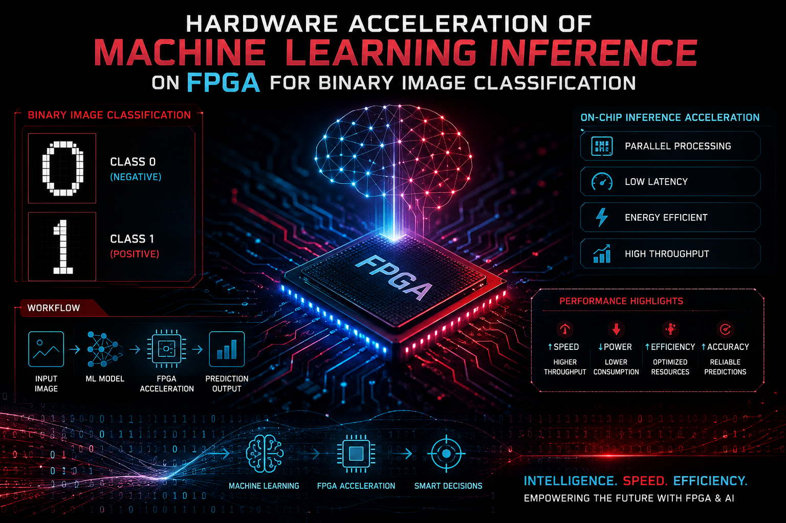

  

<h1 align="center"> FPGA + AIML </h1>

Hardware Acceleration of Machine Learning Inference on FPGA for Binary Image Classification

# 🚀 Hardware Acceleration of Machine Learning Inference on FPGA for Binary Image Classification

---

## 📌 Overview
This project presents a **hardware-accelerated machine learning inference system** implemented on FPGA for **binary image classification**. The objective is to achieve **low-latency, energy-efficient, and real-time classification** by transforming traditional software-based ML models into optimized hardware architectures.

The system integrates **image preprocessing, feature extraction, and classification modules** into a complete FPGA-based pipeline.

---

## 🎯 Key Objectives
- Accelerate ML inference using FPGA
- Reduce latency and power consumption
- Enable real-time classification on edge devices
- Optimize ML models for hardware deployment

---

## 🧠 Motivation
Traditional platforms:
- **CPU** → Limited parallelism  
- **GPU** → High power consumption  

👉 **FPGA Advantage:**
- Parallel processing  
- Low power consumption  
- Deterministic execution  
- Custom hardware optimization  

---

## 🏗️ System Architecture

### 🔄 End-to-End Pipeline
Input Image → Preprocessing → Feature Extraction → ML Inference → FPGA → Output

### 🧩 Pipeline Stages
1. Image Acquisition  
2. Preprocessing  
3. Feature Extraction  
4. Classification  
5. Hardware Execution (FPGA)  
6. Output Generation  

---

## 🖼️ Image Preprocessing

To make the system hardware-efficient, images undergo aggressive preprocessing:

- RGB → Grayscale conversion  
- Grayscale → Binary (Thresholding)  
- Image resizing (128×128 → 8×8)  

### ⚖️ Trade-off
| Resolution | Accuracy | Hardware Cost |
|------------|----------|---------------|
| High       | High     | Very High     |
| Low (8×8)  | Acceptable | Very Low     |

👉 Selected configuration: **8×8 resolution for optimal balance**

---

## 🔍 Feature Extraction
- Binary images converted into feature vectors  
- Example: 8×8 Image → 64 Features

- Captures:
  - Shape  
  - Edges  
  - Structural patterns  

---

## 🤖 Machine Learning Models

### 🔹 1. K-Nearest Neighbors (KNN)
- Uses distance-based classification  
- Optimized using:
  - XOR operation instead of subtraction  
  - Hamming distance instead of Euclidean  

✅ Benefits:
- Low complexity  
- Parallel execution on FPGA  

---

### 🔹 2. Convolutional Neural Network (CNN)
- Lightweight architecture:
  - Convolution (3×3)
  - Pooling (2×2)
  - Fully Connected Layer  

- Hardware optimizations:
  - Binary inputs  
  - Fixed-point arithmetic  
  - Reduced multiplications  

✅ Benefits:
- Efficient feature extraction  
- Balanced accuracy and performance  

---

### 🔹 3. Decision Tree (DT)
- Rule-based classification: IF feature ≤ threshold → Left
                              ELSE → Right

✅ Benefits:
- Minimal computation  
- Very low power usage  
- Fast inference  

---

## ⚙️ FPGA Hardware Architecture

### 🔧 Core Modules
- Input Buffer (BRAM)  
- Preprocessing Unit  
- Feature Processing Unit  
- Classification Engine (CNN / KNN / DT)  
- Control Unit (FSM)  
- Output Interface  

---

## 🔄 Dataflow Design

### Pipeline Stages:
1. Input buffering  
2. Preprocessing  
3. Feature computation  
4. Classification  

---

## ⚡ Optimization Techniques

- Binary image representation  
- Fixed-point arithmetic (8-bit)  
- XOR-based distance computation  
- Parallel processing  
- Pipelined architecture  
- BRAM-based memory storage  

---

## 📊 Performance Highlights

- Real-time inference capability  
- Low power consumption  
- Efficient hardware utilization  
- Accuracy up to ~80%  

---
## 📂 Project Structure
📦 FPGA-ML-Classification
┣ 📂 src
┃ ┣ 📜 knn.v
┃ ┣ 📜 cnn.v
┃ ┣ 📜 decision_tree.v
┃ ┗ 📜 top_module.v
┣ 📂 testbench
┃ ┗ 📜 tb_top.v
┣ 📂 preprocessing
┃ ┗ 📜 preprocess.py
┣ 📂 dataset
┣ 📂 results
┣ 📜 README.md
┗ 📜 report.pdf

---
## 🔬 Key Contributions

- Hardware implementation of:
  - KNN  
  - CNN  
  - Decision Tree  

- Measurement-aware design considering:
  - Latency  
  - Power  
  - Resource utilization  
  - Timing constraints  

- Optimized inference pipeline for FPGA  

---

## 🛠️ Tools & Technologies

- Verilog HDL  
- Xilinx Vivado  
- ModelSim  
- FPGA (Zynq-7 ZC702)  
- MATLAB / Python (Preprocessing & Dataset)  

---

## 🌍 Applications

- Medical image classification (Malaria detection)  
- Edge AI systems  
- Embedded vision applications  
- Smart healthcare systems  
- Real-time image processing  

---

## 🔮 Future Scope

- Support for multi-class classification  
- Integration with IoT systems  
- Higher resolution optimization  
- Deployment on edge AI hardware  
- FPGA + AI co-design frameworks  

---

## 📎 Conclusion
This project demonstrates that **FPGA-based machine learning inference** can significantly improve **speed, energy efficiency, and real-time performance**, making it highly suitable for **embedded and edge AI applications**.

---

## 👨‍💻 Author
**V N S S S R Maheedhar Bhamidipati**  
M.Tech VLSI Design  
Amrita School of Engineering, Bengaluru
